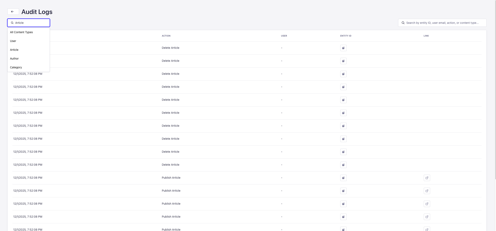

# Strapi Audit Logs Plugin

A comprehensive audit logging plugin for Strapi v5 that tracks all content type changes including create, update, delete, publish, and unpublish actions.

## Features

- ✅ Track all content type changes (create, update, delete, publish, unpublish)
- ✅ Track user login events for the user collection
- ✅ Enable/disable audit logging per content type (including user collection)
- ✅ View audit logs with filtering by content type and search functionality
- ✅ Detailed change tracking with before/after values
- ✅ User information tracking (user ID, email)
- ✅ IP address and user agent logging
- ✅ Direct link to view entities in Content Manager (hidden for delete actions)
- ✅ Entity ID column with copy-to-clipboard functionality
- ✅ Debounced search for improved performance
- ✅ Hidden content types (not visible in Content Manager or Content-Type Builder)
- ✅ Well-structured service-based architecture
- ✅ TypeScript support with comprehensive type definitions

## Installation

```bash
npm install strapi-plugin-audit-logs
# or
yarn add strapi-plugin-audit-logs
```

## Configuration

The plugin is automatically available in your Strapi admin panel after installation. Navigate to the **Audit Logs** section in the sidebar.

## Screenshots




## Usage

### Enabling Audit Logging

1. Go to **Audit Logs** in the Strapi admin panel
2. Toggle the switch for each content type you want to track
3. Audit logs will be automatically created for all changes to enabled content types

### Viewing Audit Logs

1. Navigate to **Audit Logs** → **Logs**
2. Filter by content type using the dropdown
3. Search logs by entity ID, user email, action, or content type (with debounced search)
4. Click the link icon to view the entity in Content Manager (not available for delete actions)
5. Click the copy icon next to Entity ID to copy it to clipboard

## What Gets Logged

The plugin automatically logs the following actions:

- **Create**: When a new entity is created
- **Update**: When an entity is updated
- **Delete**: When an entity is deleted
- **Publish**: When an entity is published (detected via `/actions/publish` endpoint or PUT request that sets `publishedAt` from null to a date)
- **Unpublish**: When an entity is unpublished (detected via `/actions/unpublish` endpoint or PUT request that sets `publishedAt` from a date to null)
- **Login**: When a user logs in via `/api/auth/local` (for user collection only)

### Publish/Unpublish Detection

The plugin detects publish/unpublish actions in two ways:

1. **Via dedicated endpoints**: When using `/api/{content-type}/{id}/actions/publish` or `/api/{content-type}/{id}/actions/unpublish`
2. **Via PUT requests**: When a PUT/PATCH request changes the `publishedAt` field:
   - **Publish**: `publishedAt` changes from `null`/`undefined` to a date
   - **Unpublish**: `publishedAt` changes from a date to `null`

Each log entry includes:

- Content type and entity ID
- Action type
- User information (ID and email)
- Timestamp
- Previous values (for update/delete)
- New values (for create/update)
- Changes (for update operations, showing field-by-field differences)
- IP address and user agent

## Architecture

The plugin follows a clean, service-based architecture:

### Service Methods

The audit logs service provides the following methods:

- `isEnabled(contentType)` - Check if audit logging is enabled for a content type
- `setEnabled(contentType, enabled)` - Enable/disable audit logging for a content type
- `getContentTypeSettings()` - Get all content types with their audit log settings
- `getContentTypeSettingsPaginated(page, pageSize, search)` - Get paginated content type settings
- `createLog(data)` - Create an audit log entry
- `getLogsPaginated(contentType, page, pageSize, search, entityId)` - Get paginated audit logs (supports filtering by contentType and entityId)

### Project Structure

```text
src/plugins/audit-logs/
├── admin/              # Admin panel UI
│   └── src/
│       ├── api/       # API client functions
│       ├── components/ # React components
│       └── pages/     # Admin pages
├── server/            # Server-side code
│   └── src/
│       ├── bootstrap.ts    # Middleware setup
│       ├── controllers/    # API controllers
│       ├── content-types/  # Content type schemas
│       ├── routes/         # API routes
│       ├── services/       # Business logic service
│       └── types/          # TypeScript type definitions
└── README.md
```

## Requirements

- Strapi v5.31.2 or higher
- Node.js 18.x or higher

## Development

### Building the Plugin

```bash
npm run build
```

### Watching for Changes

```bash
npm run watch
```

### Type Checking

```bash
npm run test:ts:front  # Check admin TypeScript
npm run test:ts:back   # Check server TypeScript
```

## License

MIT
